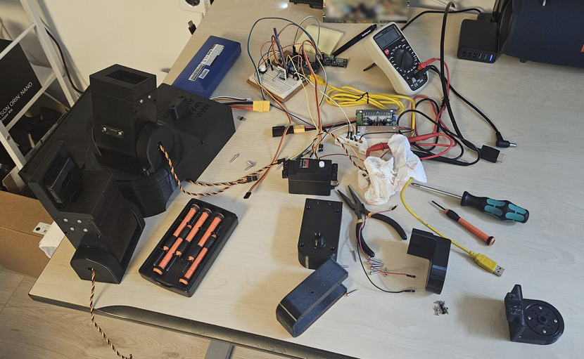
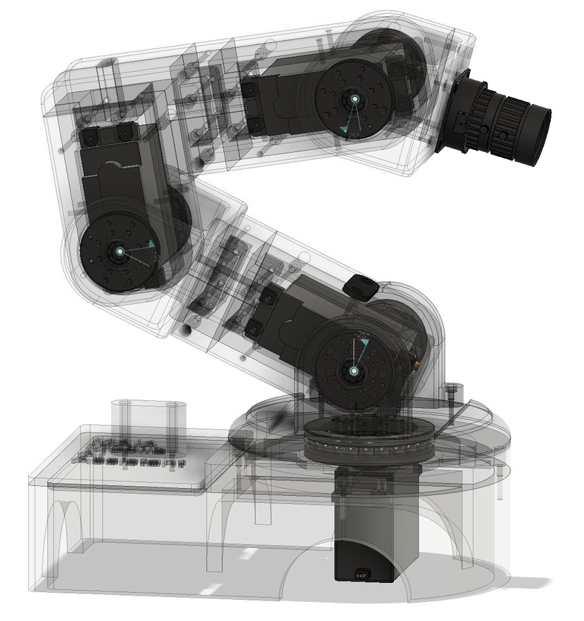
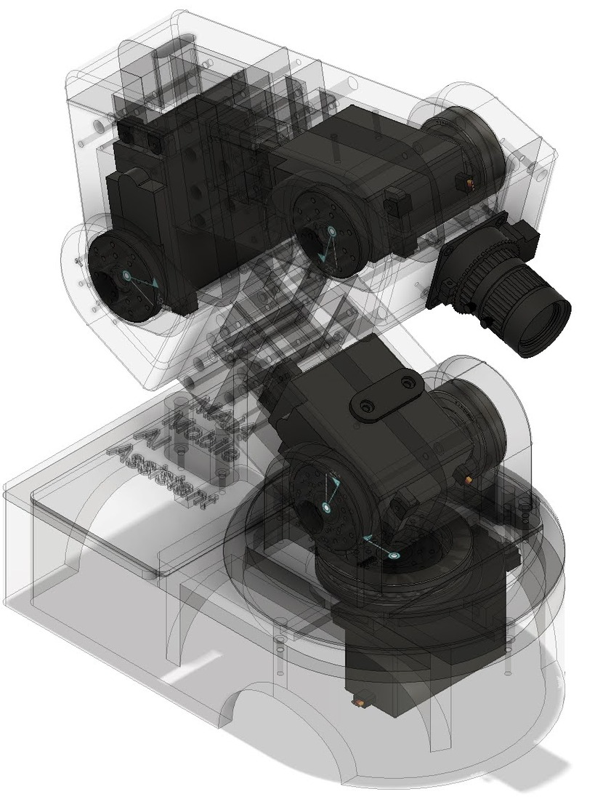
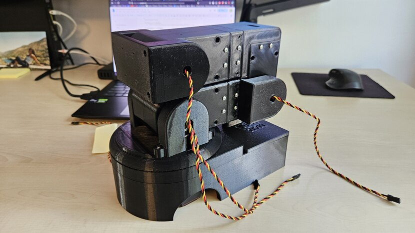
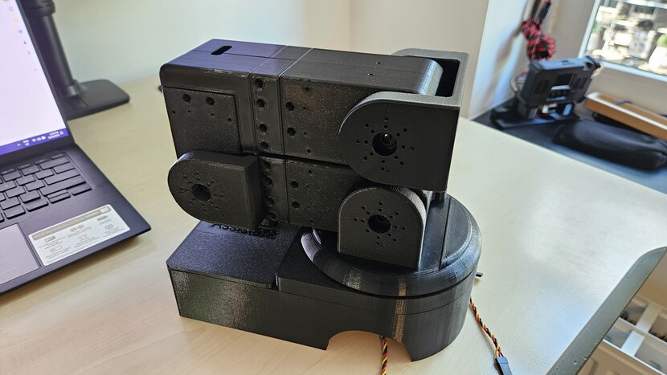
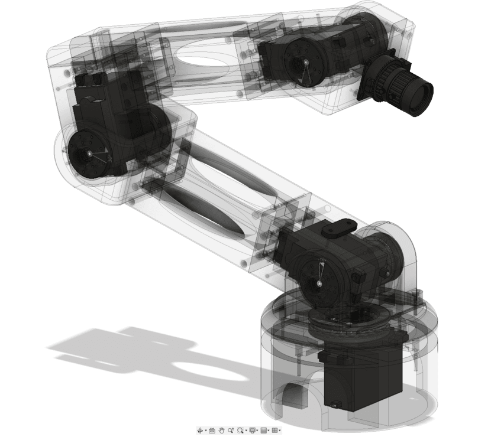
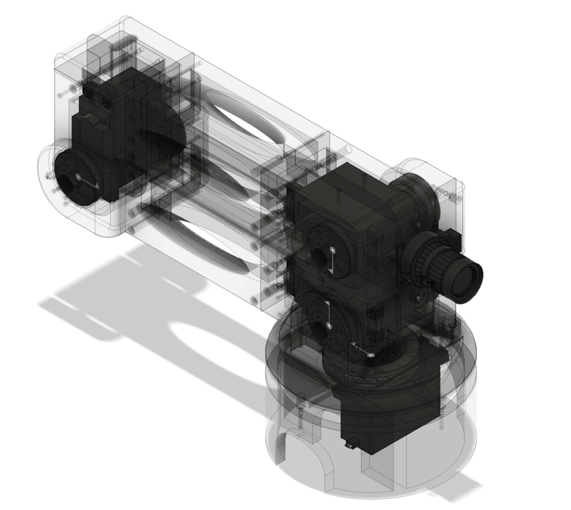
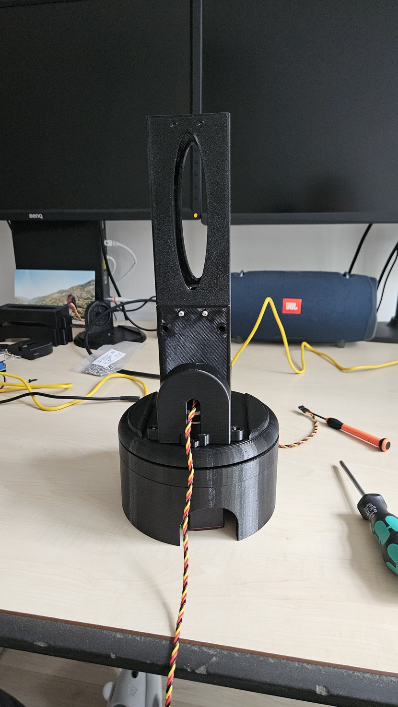
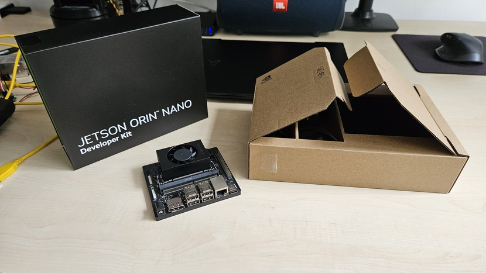
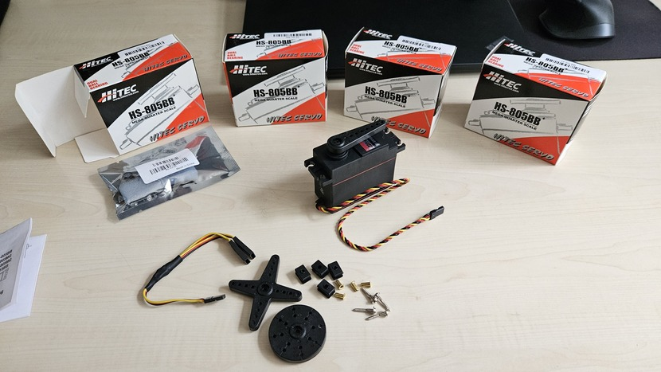

# [MAIA Mobile AI Assistant](https://github.com/ovidiurosu90/maia-mobile-ai-assistant)

## Important - abandoned
I've abandoned this version of the project, as the current design is impractical and not worth iterating over.
The servo motors are too weak, they break easily, and they're not precise enough for the task at hand.
Even with the smaller version of the arm, the movements are shaky, inconsistent, and quite noisy.

I will explore a new design with different motors on a different chassis.

## Abstract
### Problem
Interact with people in an unknown environment, and execute simple actions autonomously

### Solution
Mobile AI Assistant that is able to receive voice commands from people, navigate autonomously, and execute simple actions leveraging AI

### How
- the whole project is open-source, and can be replicated by interested parties (note it requires a variety of skills like setting up a web server, conding, 3d printing, soldering & crimping)
- this robot will be mounted on the [3R2 ROS Real Robot v2](https://github.com/ovidiurosu90/3r2-ros-real-robot-v2), in order to navigate autonomously

### Notes
- the project is in early stages, and everything will change along the way (requirements, design, components, etc.)
- at the moment there is no clear end-solution, so a lot of its core capabilities are still to be researched

## Robot potential capabilities
- monitor people and take actions based on their sentiments (e.g. say a joke if I'm sad, or tell me when my girlfriend is upset)
- meet and greet at the door, or in any room of the apartment
- simple voice interaction (e.g. answering what's the temperature outside)
- follow a person inside an apartment and take notes (e.g. for shopping list, or documenting training exercises)

## Important Links

| Name | README |
| --------------------- | ------------- |
| BOM Bill Of Materials | [BOM.md](BOM.md) |

## Images

I've started with a bigger version (longer arms, June 2024), though the lower servo motors were not strong enough to move the arm.

After that attempt, I've created a smaller version (shorter arms, September 2024), which helped, allowing the arm to move.

